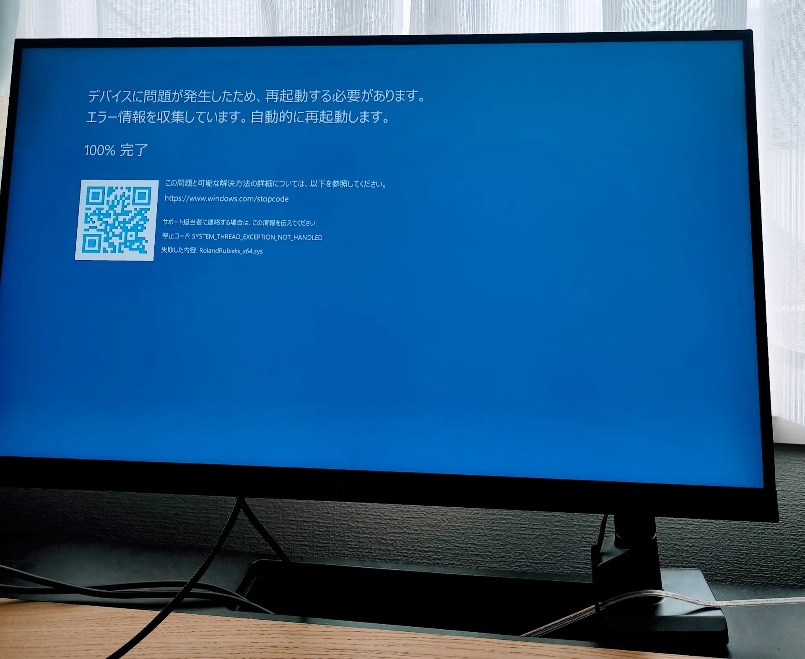
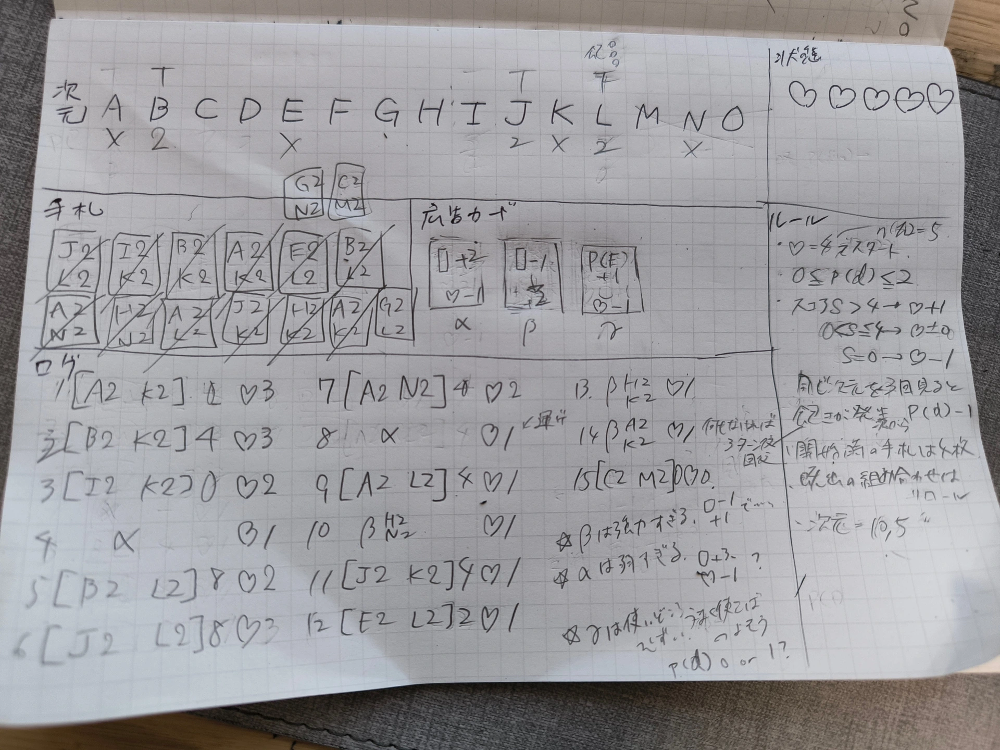
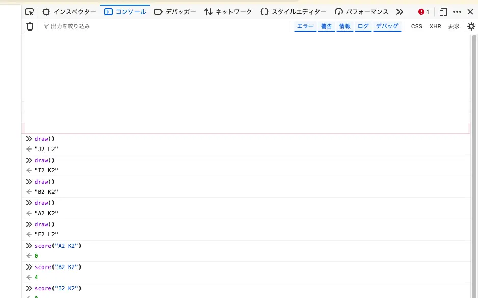

こんにちは。kypです。このブログを、今回の記事で初めてご覧になる方もいらっしゃるかもしれません。３年もの間、この開発日記は影でひっそりと更新してきたのですが、今回からは公式のSNSアカウント等にも更新のお知らせを投稿するようにしました。

改めて書くと、この開発日記は、SAFE HAVN STUDIOの代表であるkypが最近の活動などを隔週火曜日に投稿するものです。えっと、まあ、今日は木曜日なんですけど、サボってたわけじゃなくて、一応それには理由があって......。

#### 締切

もう何度も書いてしまっていて申し訳ないのですが、SAEKOのSwitch版が6月25日に発売される予定です。ダウンロード販売だけでなく、パッケージ版が通常版・限定版の２種類販売される予定で、しかも店舗によって違う特典が付いてきます。お店によっては有償特典もあります。

<figure>
    <blockquote class="twitter-tweet">
      

        <a href="https://twitter.com/hashtag/saekogame?src=hash&amp;ref_src=twsrc%5Etfw">#saekogame</a>
        のSwitch版特設ページが開設されました。店舗別特典などが一覧でまとめられているので、ぜひご覧ください👀
        <a href="https://t.co/02xrznxNuq">pic.twitter.com/02xrznxNuq</a>
      

      — SAEKO: Giantess Dating Sim 🔜 Switch (@saekogame)
      <a href="https://twitter.com/saekogame/status/2039134170564497829?ref_src=twsrc%5Etfw">April 1, 2026</a>
    </blockquote>
    
    <figcaption>
      今すぐ<a href="https://hyperreal.jp/saeko-switch/">特設ページ</a>をチェック！
    </figcaption>
  </figure>

全てが6月25日に出るということで、時を遡って２か月前の現在、全ての締め切りが同時に襲いかかりつつあります。自分たちにとってはこれが初めてのパッケージ版発売で、ただでさえゲーム本体の製作のために必要なアセット数に圧倒されていますし、さらに物理的に製造する特典についても考えることが多くて難しいです。正直、予想以上に大変な状況となっています。

アセットはグラフィック担当のメンバー(koh, maztani)に頑張ってもらうことが多いのですが、限定版特典の１つにサントラCDがあり、今週は僕もその締め切りで死にかけていました。元々のBGMは開発のかなり終盤に行われていて、いま聴くと正直恥ずかしくなるようなミスもあります。そのため、このタイミングでほとんど全曲のアレンジを見直すことにしましたが、この作業が本当に大変でした。

DTMの経験者なら分かると思いますが、完成後のプロジェクトファイルというのはすぐに壊れるものです。ダウンロードしたサンプルや、当時使っていたバージョンのプラグインなど、自分でも気づかないうちにどこかに消えてしまっていたものが沢山あって、過去のプロジェクトファイルを開いても謎のパッドしか鳴ってないみたいなことがよくあります。ある程度の経験者だったら、各トラックのstemを書き出したりしてるんだろうけど、締め切り直前の自分にはそんな発想まるで無かったし......。

ということで、今回は気が遠くなるような時間をかけて当時のプラグインやサンプルを可能な限り収集し、できるだけ当時のプロジェクトファイルからアレンジをやり直しました。ドラムパターンの調整やトラック感の音量バランスなど、2mixの状態じゃないと改善できない箇所がたくさんあったからです。

また、今回は[Ozone 12](https://izotope.jp/jp/products/ozone-12/)や[Metric AB](https://www.plugin-alliance.com/products/metric-ab)などを使い、アルバム単位でのマスタリングにもできるだけ時間をかかりました。とはいえ、マスタリングは本当に苦痛で、全然思い通りにならないし自分のアレンジの拙さにも気づくし、とにかく精神が崩れない範囲でやれることをやっています。具体的な手段はまだ考えていませんが、今回再制作した音源については、過去のバージョンの購入者が改めて買う必要がない形で、可能な限り多くのプラットフォームに届けたいと思っていますので、よろしくお願いします。まあ、直接聴き比べないと分からないくらいの差だとは思うのですが、以前よりも少し洗練されたクオリティでBGMを楽しめるようになるはず。

ちなみに、僕以外のメンバーが作っているグラフィック系の特典についても、作業は順調に進んでいます。５月頃には作業も落ち着いてくると思うので、そのタイミングでちょっとずつSNS等でもチラ見せしていけたらいいな。

#### 新作とか

SAEKOの作業はやりがいがあるし、この記事を読んでくださっている方も大半はSAEKOの情報を求めてくださっているのだとは思うのですが、並行して少しずつ新作の準備も進めています。特典やPRは楽しいんだけど、やっぱり自分たちはゲーム開発者で、新しいゲームを作っているときが一番心が安らぐからです。

前回の記事では、ゲームのテーマは決まっているけれど、システム面で面白いゲームにするための小さなピースが欠けている気がする、と書いた気がします。そして、答えを求めているためにゲームデザインの本を爆買いしたとも。その中の1つ、[ゲームデザインバイブル](https://www.amazon.co.jp/dp/4873118018/)は本当に良い本でした。ゲームデザインの本って、いわゆる学術的な視点も含めた理論的な本と、現場で活躍している方によるノウハウが書かれている経験的な本とに二分されているイメージがあるのですが、この本は絶妙な中間のバランスを取っていた気がします。読み物として納得できて面白く、かつ実際のゲームデザインの参考にもなる素晴らしい本でした。ゲームデザインで悩んでいる開発者がいいたら、ぜひ買ってみてください（念の為：アフィリエイトプログラムには加入していません！）。

で、その本の教えの中に、システムよりまずプレイヤーにさせたい経験から考えろ、というのと、紙でも構わないので早めにプロトタイプを作成しろ、というのがあります。どちらもコードでシステムを書きながら悩んでいる自分にはぶっ刺さりました。というわけで、

文字が汚すぎて恥ずかしいんですが、まあこんな感じで紙に一人でルールを書いてテストプレイを進めています。それと、ランダム要素や非公開の情報など、中には紙だけで再現することが難しいものもあります。そのため、必要最小限の機能だけを素のJavaScriptで実装し、ブラウザのコンソールを通して利用しています。

（実装するのは紙で再現できない最小限の機能に絞り、ターンの進行や計算などはできるだけ自力でやったほうがいいです。プログラムを書いてしまうと、ルールを変更する際に書き換える必要が出てきてしまって、心理的な障壁になってしまうからです）

で、このペーパープロトタイプを作って、修正しながら何度も遊んでみた感想なんですが、けっこう面白いかもしれないです。何のグラフィックもストーリーもなくプレイしていても、それなりにハマってしまう魅力がありました。

というわけで、そろそろ鉛筆の代わりにノートパソコンを持って、実際のゲーム制作を再開しようと思います。ここからどうなるかは分からないです。でも、なんというか、以前までに感じていたパズルのピースが欠けている感覚は薄れて、これからやれることについてのワクワクが満ち溢れています。

まあ、まだまだ締め切りはあるので、まずはそっちをやらなきゃなんだけど。

#### Ebitengine ぷちConf \#4

書いてて思い出したんだけど、来週末に[Ebitengine](https://ebitengine.org/)のゆるい交流会があり、kypもそこで話します。これまではLT枠で短い発表をしてきたのですが、今回はなんとゲスト枠で、20分も発表時間を用意してくださいました。うれしい。でも何話そう......。

4月17日に渋谷スクランブルスクエアのめっちゃいい会場で開催されるので、Go言語でのゲーム開発に興味がある方はぜひ覗いてみてください。久々に技術の話ができてワクワクしています。今から一生懸命スライドを作ります。

<figure>
    <blockquote class="twitter-tweet">
      

        皆さん大変ご無沙汰しております。EbitengineぷちConf #4 を 4/17
        (金) に開催することになりました!
        今回のゲストスピーカーは、Saekoの開発に携われたkypさん (<a href="https://twitter.com/_newkyp?ref_src=twsrc%5Etfw">@_newkyp</a>)
        です。参加者、LT発表者ともに募集中です。どうぞよろしくお願いします。
        <a href="https://twitter.com/hashtag/ebitengine?src=hash&amp;ref_src=twsrc%5Etfw">#ebitengine</a>
        <a href="https://t.co/h50GxNvnLt">https://t.co/h50GxNvnLt</a>
      

      — Ebitengine ぷちConf (@EbitenPetitConf)
      <a href="https://twitter.com/EbitenPetitConf/status/2027606981180330079?ref_src=twsrc%5Etfw">February 28, 2026</a>
    </blockquote>
    
  </figure>

おわり！
