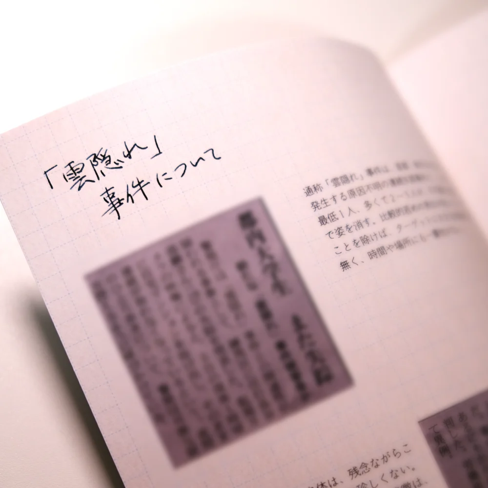
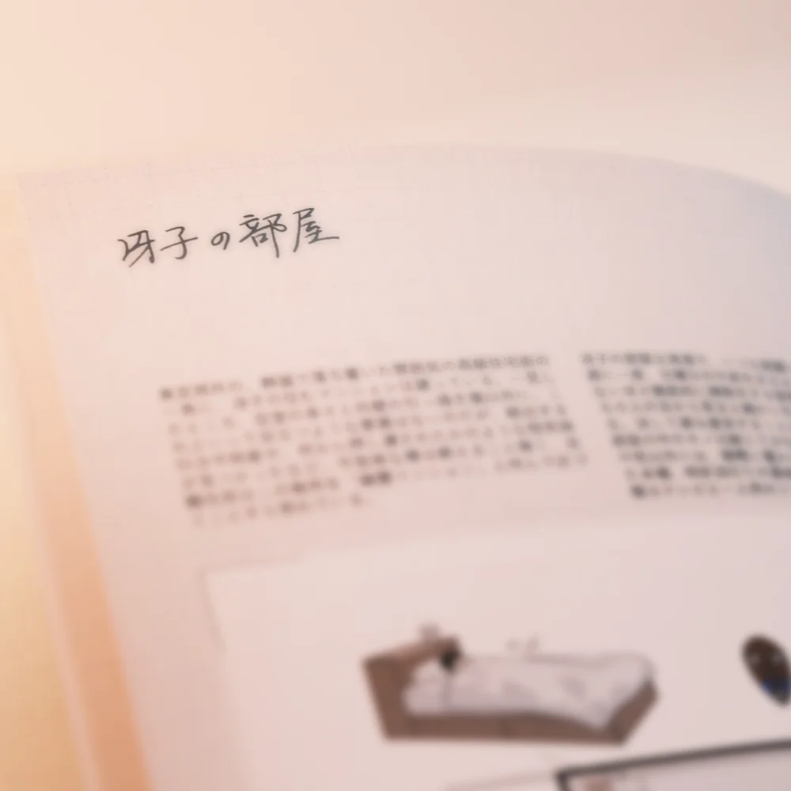
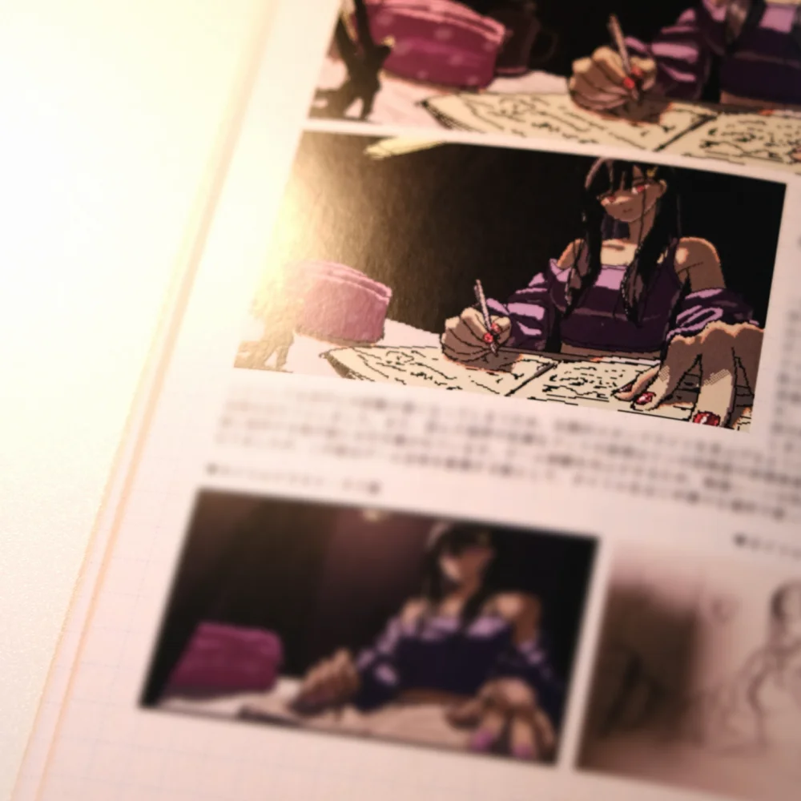
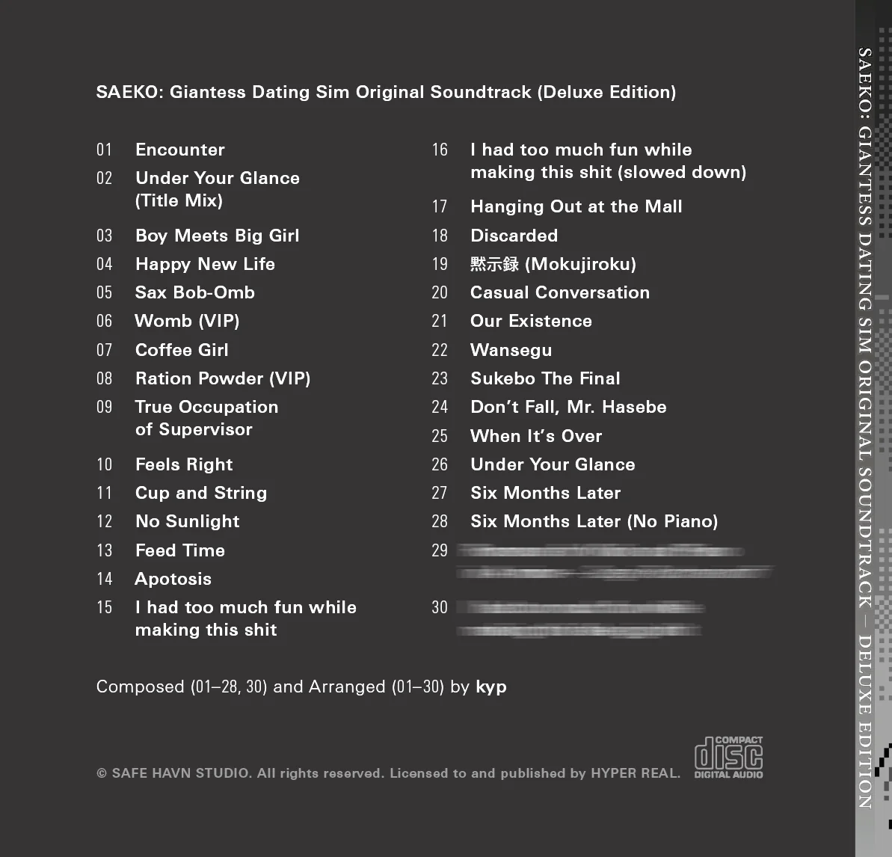

こんにちは！kypです。これは1ヶ月ぶりの開発日記です。もう月次更新ということにしようかな。

#### Switch版の進捗

まずはSAEKOのSwitch版進捗について！

通常版・限定版のパッケージに加えて、一部の店舗では無償・有償の店舗特典があり、あとはまだ秘密の企画もあったりして、この数週間は常に10並列くらいで物事が動いていました。ただでさえ数が多いのに、物理的なグッズ制作ということで関わる人の数が多く、間に入っていただいていたパブリッシャーの方はずっと大変そうでしたね......。ありがとうございます。

デジタルなゲームの制作と違い、パッケージ版の制作では物理的な色やサイズの確認が必要になるので、ほとんどの特典では実際に印刷見本を開発者の手元に送ってもらいました。これが想像以上にメチャクチャいい......らしい。グッズ関連は主にkohとmaztaniに担当してもらっていて、それぞれ数百kmくらい離れた場所に住んでいるので、これを書いているkypは確かめられていないのですが。でも、maztaniから送られてきた画像を見る限り、確かにめっっっちゃいい感じです。

特典版の制作は想像以上に大変なことも多く、ここ数ヶ月は悩みも多かった気がしますが......それでも、形に残る特典を納得のいく形で作ることができて、本当に良かったと思います。

ところで、そんな素晴らしい『SAEKO: Giantess Dating Sim』のNintendo Switch™版パッケージについて、2026年5月現在、事前予約をネット通販や全国の小売量販店で受け付けているようです。通常版3,960円(税込)、限定版7,700円(税込)で、さらに一部の小売店では有償特典も用意されているらしいです。発売は2026年6月25日ですが、店舗ごとに初回予約特典があり、これは6月25日を逃すと手に入らなくなる......かもしれません。どうなんだろう。あんま詳しくないです。

詳細は[Switch版の特設サイト](https://hyperreal.jp/saeko-switch/)をチェック！

#### Bitsummit

5月24〜26日まで、もはやおなじみのインディーゲームイベント・Bitsummitが京都のみやこめっせで開催されます。毎年7月の酷暑期に開催されていたのですが、今年は比較的涼しい（だけど既にかなり暑い）5月末開催となり、非常にとても嬉しいです。

このブログを書いている段階では、まだ詳細が公開されていないのですが、SAEKOは今年もHYPER REALさんのブースでBitsummitに出展する......と思います。詳細はまだ公開されていませんが、今回はSwitch版のPRということで、実際にSwitch上でのプレイを体験できるようになる......とも思います。

あと、もし迷っている人がいたら、金曜の夜には京都入りしているといいことがある......かもしれないです。噂によると、夜に何らかのイベントが開催されるらしく、kypはディスクをジョッキーする練習を始めているとか、いないとか。限定版特典のサウンドトラックに収録されるボーナストラックも、ひっそり会場で初出ししちゃおうとか考えている......らしい。

#### その他

その他！ここ数ヶ月書いている通り、SAEKOのSwitch版発売準備と並行して、新作の準備を進めてきました。これまでの作業はペーパープロトタイプが中心だったのですが、ようやく実際のゲームの開発が始まり、あわせてシナリオやアートスタイルの検討なども始まりました。

色々な学びはあるのですが、とりあえずまず言えるのは、実際のゲームを作っていく過程はとても楽しい、ということです。大部分がビジュアルノベルだったSAEKOとは異なり、次回作はもっとゲーム性の高いものになります。また、非常に明確なインスピレーションのあったSAEKOとは違って、次の作品のテーマについては現時点で自分が知らないことも多いです。

本当にこのシステムで面白いだろうか、話が膨らむだろうか、と考えちゃうこともありますが、今の気持ちとしては、その未知について悩める状況がとてつもなく嬉しいです。高難易度のパズルゲームみたいなもので、現時点では解法のない問題がいくつかありますが、具体的なゲームを作っていくうちに、きっといつかひらめきが訪れる......んじゃないかなと思います。博打みたいでワクワクしますね。

それと、シナリオを書くのはやっぱりいつでも楽しいです。脳の普段使わない部分が活発になります。ここ数ヶ月書いている通り、次回作のモチーフは、表面上SAEKOとは全然違うものになります。でも、あくまでそれは表面だけのことで、芯の部分はきっと前作と共通するものになるはずです。つまり暴力とかセックスとか性格の悪い（？）ヒロインとか。なぜならそれ以外書けないから！

おわり！
