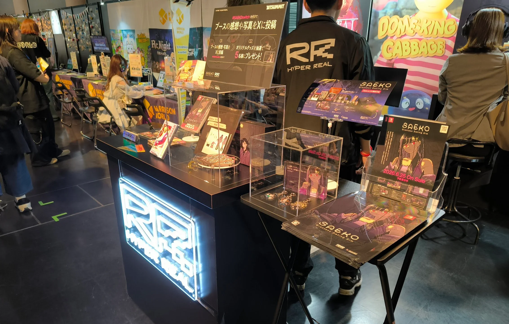
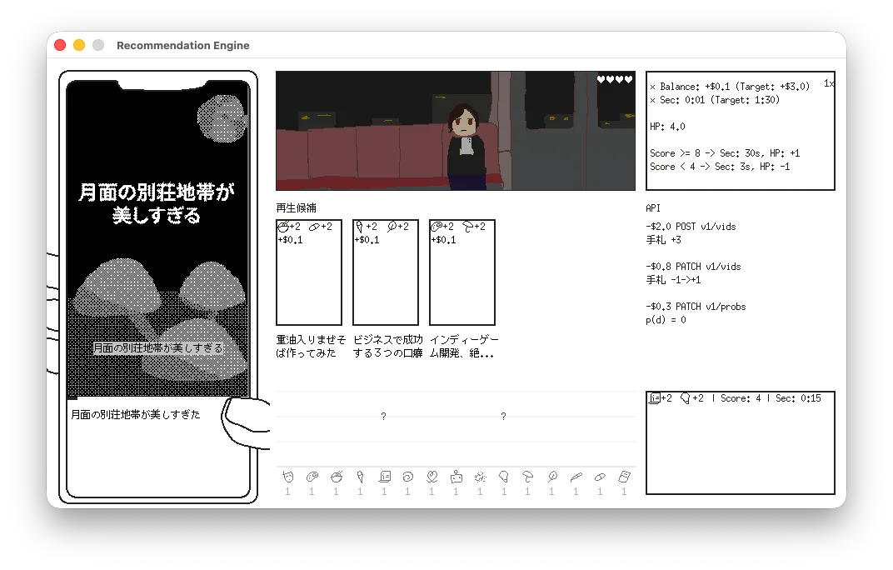

こんにちは。kypです。これは開発日記です。最近はかなり不定期に更新していたのですが、これからしばらくは月イチ更新を目指していこうと思います。気が向いたら読みに来ていただけると嬉しいです。

#### Bitsummitとか

まずは先月末のBitsummitについて、会場にお越しいただいた皆様、本当にありがとうございました。SAEKOはSwitch版の試遊展示を行ったほか、パッケージ版に付属するアイテムや、あわせて新規に発売するグッズの展示を行いました。私も初めて見たのですが、物理的に存在しているグッズを見ると感動しますね。

新規発売のグッズは、全て[アニメイト様の通販](https://www.animate-onlineshop.jp/products/list.php?mode=search&smt=SAEKO%3A+Giantess+Dating+Sim&srsltid=AfmBOopcWqsfQPFm5Hz8jLoHxUtYEV6GnE_UeTKAnpi69Or4_17B2Q-i)で発売予定ですので、ぜひチェックしてみてください。これを書いている時点では、予約開始待ちというステータスになっているので、そのうち予約が始まるはず...！気づいたらSNSで連絡するようにします。

その他、個人的なことになるのですが、Bitsummit期間中に開催されたHYPER REALさん主催の交流イベントで、人生初のDJを体験しました。学びの多い経験になりました（婉曲表現）。DJプレイそのものについては、もーーーー全然こんなはずじゃなかったボタン押し忘れたうわーーーーーーーみたいな感じだったのですが、なんとかSAEKOのBGMやファンメイドのマッシュアップを流すことができたり、他の出演者や来場者と音楽の話ができたり、本当に貴重な体験でした。改めて、お越しいただいた全ての方々に感謝いたします。SAFE HAVN STUDIOは京都にルーツのあるチームなのですが、その頃の知り合いが何人か来てくれたのも非常に胸熱でした。

それと、自分は全然ブースにいないにも関わらず、イベントのたびにSAEKOのファンだという方に声を掛けていただきます。これも本当にありがたいです。ゲームの感想って、基本的にオンラインのコメントで貰うことが多くて、もちろんそれもめっちゃ嬉しいんだけど、実際に生きた人間からSAEKOの感想を聞くとまた違う種類の喜びがあります。

シナリオを書いた人間としては、年上の方から学生の子まで、いろんな見た目の人たちに声を掛けられるのも嬉しいです。すごく大げさに言うと、表面上の性別や年齢や国籍といった属性を超えて、人間としての普遍的な何かに自分の創作が刺さってくれているという証拠だと思います。すごく大げさに言うとね！

#### 新作とか

SAEKOのSwitch版開発が一区切りついたので、新作の開発を進めています。以前にもプロトタイピングの進捗は書いたことがあると思うのですが、ここ数週間でやっと実際のビルドを作り始めました。チーム内で話し合いをして、イラストやUIデザインといったゲーム内アセットに取りかかってもらっています。とはいえ、自分自身、まだこのゲームの世界観を完全に掴み切れていないこともあり、一旦は絵も含めて全てのアセットを自分で雑に作っています。見栄えは決して良くないですが、誰にも遠慮せずに削除したり差し替えたりできるのが良いポイントですね。

具体的なプログラムを動かすのはとても楽しいです。一方で、頭の中で考えていたアイデアを実際に動かすと、予想外の見え方になっちゃったなとか、そもそもこれ面白いんかなとか、認識していなかった問題点がたくさん出てきます。頻繁に絶望してベッドにダイブします。でも、着実に新しい何かが組み上がっていく感覚はとても楽しいです。新しい何かを動かす楽しい部分と、その新しいものを客観的に評価する苦しい部分とを、しばらく交互浴しながら開発を進めることになりそうです。結果的に良いものができたら嬉しいです。

#### おわり

おわり！2〜3年ぶり？にまっさらな状態からゲームを作っているわけですが、これはめちゃくちゃ楽しいです。心の平穏、涅槃の境地を感じます。この数年間、ただパソコンの前に座るだけじゃない経験を積んできましたが、やっぱりただパソコンの前に座っているときが一番充実しています。

最近、何個かメディアインタビューに答える機会をいただきました。Switch版発売に合わせて公開されるのだと思いますが、色々な質問に答えたり、過去の作品を振り返ったりしているうちに、自分の中で創作における好きな部分みたいなのが見えてきた気がします。

そして！それは！！人を驚かせるということだと思う！！！自分がいなければこの世に存在しなかったものを作って、まだカッコいいとされていないものをカッコよく見せたいです。それでプレイ後に世界の見え方がちょっとでも変わったらこれ以上に嬉しいことはありません。そのためにはテキストや絵や音楽といったアセットのディテールと、それらを繋ぐ一貫したアイデアが必要になります。うおおおお。頑張るしかない。

あとは暴力やセックスや性格の悪い女の子が出てくる作品を作りたいです。あー、このオチ、前回の記事と同じだね？
