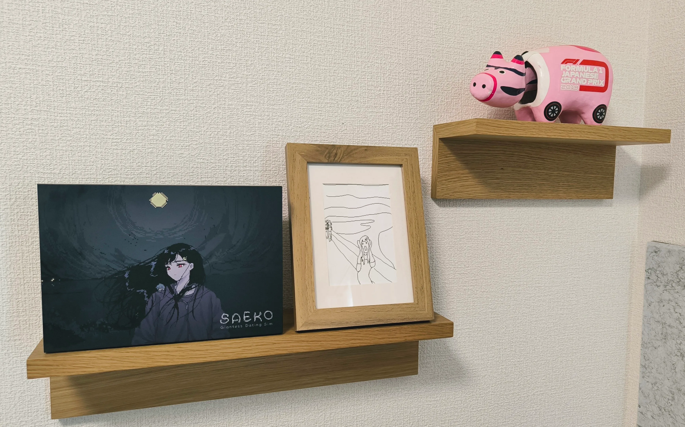
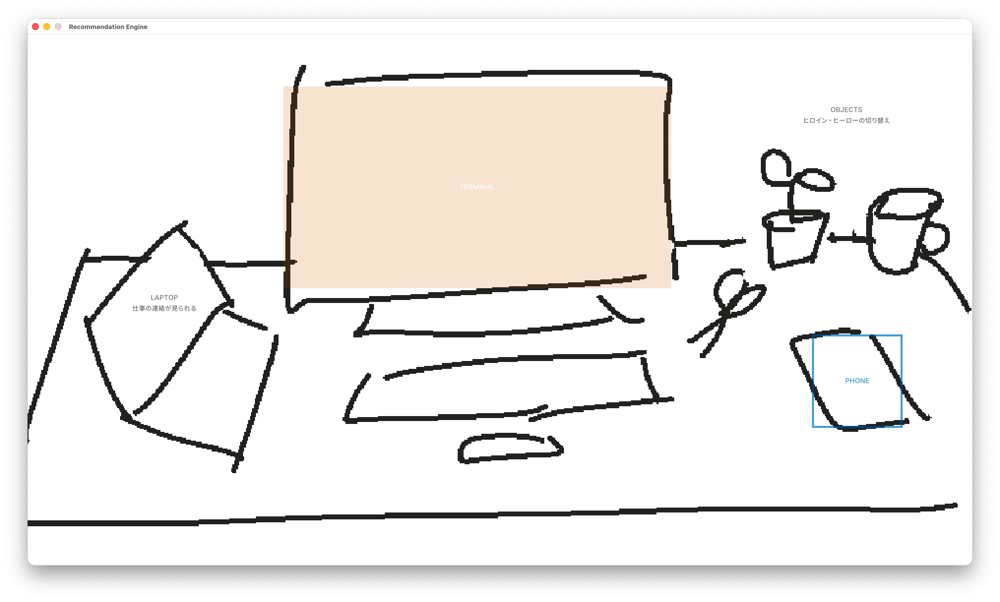

こんにちは！SAFE HAVN STUDIOのkypです。今日は7月7日、七夕です。でも七夕って何をする日なんでしょうね？なんかジラーチのイメージがあります。これは7月の開発日記です。

#### Switch版発売開始

2026年6月25日、SAEKO: Giantess Dating SimのSwitch版の発売を開始しました。通常版・限定版のパッケージと、それからNintendo Store上でのダウンロード販売という3種類の方法で購入することができます。無理のない範囲で購入を検討していただけると喜びます......が......！

この日記を書いている7月6日の時点でも、すでに多くの購入報告を拝見していて、既にだいぶ限界まで喜んでいます。特に限定版や店舗特典については、おうちに届いた画像を投稿してくださっている方も多く、見るたびに感激しています。みんな本当にありがとう......！

ここからは自画自賛になってしまうのですが、SAEKOの限定版ボックスについては、まじでとんでもなく良いものができたと思います。ボックスやCD、設定資料集など、ほとんど全てのデザインを自分たちで行いました。なかには監修をしているうちに自分たちでやりたくなっちゃった、という経緯のアイテムもあり、関係各所には修正続きでご迷惑をおかけしたと思います。ただ、実際のモノとして出来上がったアイテムを見ると、やっぱりゲーム本編の制作者にしかない再現できないディテールみたいなものがあり、今回はそれを正しく表現できたんじゃないかと思います。妥協せず、自分たちで入稿データを作りきるところまでやることができて、本当に良かったです。

また、Switch版発売と時を同じくして、追加アップデートを配信しました。いずれかのルートを解禁すると、タイトル画面に「プロトタイプ」というモードが追加され、そこから開発のごく初期に書いたシナリオが読めるようになります。2023年(!)の東京ゲームショウで展示していたデモと同じものです。

このシナリオを書いた頃はまだゲーム開発のことは全然分かってなくて、コーディングに飽きたときの暇つぶしみたいな感じで、プロットもキャラ設定もなく書き進めていた記憶があります。一部の会話は冗長すぎて削りましたが、それでも読み返すと恥ずかしい部分があります。ただ、あくまで自分の耳に入ってくる範囲ですが、追加シナリオも好評なようで嬉しいです。

この頃はまだ「覚悟」が決まっておらず、ゲームの目標は「パラメータを調整して他の小人を生き延びさせる」でした。それゆえシナリオもシステムも本編と比べるとぬるいです。ただ、本編とは別物というわけでは無く、世界線としては本編と同じ時間軸にある想定で書いています。アップデートはSwitchだけでなくPC版にも無料配布されているので、ご興味のある方は久々にSAEKOを起動してプレイしてもらえると嬉しいです。

#### 新作とか

SAEKOのSwitch版も発売され、開発チームのリソースは新作に全振りされています。できたら今年10月のゲームダンジョンに出たいな〜などと考えており、そこからスケジュールを逆算し、必要なタスクを書き出したりしました。前作の記憶のフラッシュバックで冷や汗をかきながら。

とはいえ、正直「まだタスクに分割できるほど決まってねえ」みたいな仕様もたくさんあり、まずはゲームの形をきちんと考える必要があるなと思います。そのために現在は、最低限のアセットで通しプレイできるビルドを作っています。画像は現在のスクリーンショットです。やばいですね。

まあ見た目は最悪なんですが、ざっくり「ゲームの全体構造」みたいなのをメンバーに伝えるには良い手段だと思うし、何より実装の過程を通して、自分自身でゲームの輪郭について考える時間が生まれている......と思う！SAEKOのときもこのプログラミング中が一番アイデアを出せる時間だったし、苦しいけど必要なプロセスなんだと思います。ちなみにこの数日でヒロインの設定が10倍くらいに膨らみました。これは現実逃避の妄想ですね。

目標として10月末のイベント出展を掲げていますが、現時点ではご覧のように固まっていない部分も多く、本当に出展できるかはまだ分からないと思います。おそらく参加募集は8月半ばだと思われるので、その頃までには試遊用のビルドを作りきれそうか見極めたいです。今回のゲームはノベルゲームではなく、それなりに戦略性のあるゲームになると思うので、「冒頭の10分」を作る労力がけっこう高いんじゃないかなと思います。ただ、仮にイベント出展がダメだったとしても、ティザーは今年の秋頃までに出したいですね。秘密を守るのはつらいので、早く開発日記に今作ってる部分の悩みとか書けるようになりたいです。

#### おわり

今月の開発日記はここまで！

書き忘れてたけど、SAEKOのSwitch版発売に合わせて、けっこういろんな出来事がありました。まずは[ゲムぼく。](https://gameboku.com/)さんによる[インタビューがAutomatonさんに掲載されたり](https://automaton-media.com/articles/interviewsjp/saeko-20260624-451342/)、[電撃Nintendoさんの8月号](https://x.com/dengekinintendo/status/2067793229563732357)にもインタビューを載せていただいたりしています。ありがとうございました。でももう話せることないです。[過去のインタビュー](https://kyp.jp/about/)と話がかぶっていても見なかったことにしてください。

あと、アニメイトさんで[特設コーナーやGratteを作ってもらいました](https://www.animate.co.jp/gratte/43795/)。池袋店と秋葉原店の様子を見に行ったんですが、もうまじでめっちゃすごかったです。

<figure>
    <blockquote class="bluesky-embed" data-bluesky-uri="at://did:plc:cw7ouw773yjncd7rmby4o7po/app.bsky.feed.post/3mp3jfb5nu224" data-bluesky-cid="bafyreidr2beiwzt57rkiverrhqlvx6dorfle2xknr3pdceuzag3qteyhdq" data-bluesky-embed-color-mode="system">
      

        アニメイト池袋店・秋葉原店にて、 #saekogame
        の特設コーナーを設置してくださっています。でかくてすごいです  <a href="https://bsky.app/profile/did:plc:cw7ouw773yjncd7rmby4o7po/post/3mp3jfb5nu224?ref_src=embed">[image or embed]</a>
      

      — SAEKO: Giantess Dating Sim (<a href="https://bsky.app/profile/did:plc:cw7ouw773yjncd7rmby4o7po?ref_src=embed">@safehavn.dev</a>)
      <a href="https://bsky.app/profile/did:plc:cw7ouw773yjncd7rmby4o7po/post/3mp3jfb5nu224?ref_src=embed">2026年6月25日 12:47</a>
    </blockquote>
    
  </figure>

すっごく感覚的な話になっちゃうんですが、PC版のリリースはジェットコースターみたいな感じで、数字や感想が一気に押し寄せてくる脳汁や高揚感がやばかったです。Switch版は、それに比べると届けられる人数も限られてるし、感想の数もPC版のときほどはありません（既にゲーム自体がPCで出てしまっているというのがありそう）。でも、知ってる場所に自分の作品が物理的に並んでいるという実在感はすごくて、「自分は本当にゲーム開発者になったんだなあ」みたいな実感が湧いてきています。

新作のテーマはSAEKOと全然違うし、不安な部分もまだあります。でもまあ......SAEKOのパッケージを見てると......なんとか作りきれそうな気がしてくるね！というわけでいまメンタルの調子が良いです。風が気持ちいいです。SNSとか見過ぎないようにしてがんばります。みんなもがんばろう。

おわり！
