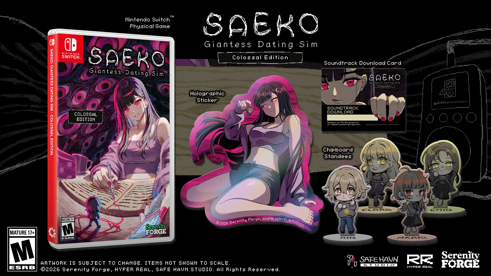
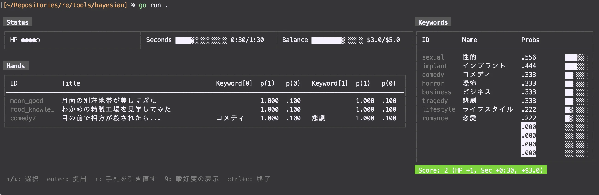

こんにちは。kypです。これは今月の開発日記です。

#### SAEKOの北米版パッケージが出ます

SAEKOの北米版パッケージ、「[SAEKO: Giantess Dating Sim - Colossal Edition](https://store.serenityforge.com/products/saeko-giantess-dating-sim-colossal-edition)」が8月26日に発売されます！特典やパッケージは[Serenity Forge](https://serenityforge.com/)さんに作っていただいたもので、カバーアートはなんとDDLCのアートワークを手がけた[Satchely](https://linktr.ee/satchely)さんに描いていただいたものです。超好き。

<figure>
      <blockquote class="twitter-tweet">
          

              Take a peek at the inner cover of SAEKO:
              Giantess Dating Sim Colossal Edition!<a href="https://x.com/_Satchely?ref_src=twsrc%5Etfw">@_Satchely</a>
              absolutely knocked it out of the park with this
              illustration, where every mischievous detail of
              Saeko and her little “collection” is brought to
              life beautifully. 💜  Make room on
              your shelf…
              <a href="https://t.co/sRpAutcvDM">pic.twitter.com/sRpAutcvDM</a>
          

          — Serenity Forge (@SerenityForge)
          <a href="https://x.com/SerenityForge/status/2075332657232163200?ref_src=twsrc%5Etfw">July 9, 2026</a>
      </blockquote>
      
      <figcaption>やばい</figcaption>
  </figure>

たびたびインタビューなどでも話していますが、自分がインディーゲームを知ったきっかけはVA11 HALL-Aで、それ以降も海外のアドベンチャーゲームをたびたびプレイしてきました。DDLCももちろん好きだし、個人的にはDDLC Plusの追加エピソードが強く印象に残っています。今回、このような形でSerenity Forgeさんや海外のクリエイターと関わることができ、本当に光栄です。

あと、海外の人に描いてもらった絵って、どれも日本のイラストとは微妙に違う魅力があっていいよね......。

#### SAEKO v2.1.4 アップデート

その他、細かい話ですが、[SAEKOのV2.1.4アップデート](https://steamcommunity.com/app/2492120/eventcomments/591810592556404198/)を実施しました。これまでのビルドとは別に、「非圧縮ビルド」というものを配信しています。画像やスクリプトのファイルなどをあらかじめ圧縮しておくのではなく、個別のファイルとして読み込むようにしたものです。読み込みは実行時に行われるので、通常のエディタで画像やスクリプトを改変すると、その改変したファイルに基づいたゲームがプレイできます。

個人的にSteamのMOD文化が好きだったのですが、開発中は余裕がなく、MOD対応の機能を入れることができませんでした。今回の非圧縮ビルドも、単にリソースを動的に読み込めるようにしただけで、決してMODフレンドリーになったとはいえないのですが、少しはMOD文化に対して誠実な構造になったのではないかと思います。

スクリプトシステムも自作で、プログラミング的にも面白い部分があると思うので、ぜひ覗いてみてください。あとはソースコードも公開しちゃいたいね。今はダメでも、5年後くらいには......。

#### 新作とか

新作の準備も進めています。先月に引き続き、ゲームのアイデアは固まっていて、あとは適切なシステムを考えるためのプロトタイピングを繰り返している......という段階です。アイデアを思いつき、実装して、面白くなかったりうまくシナリオに馴染まなかったら没にする、という繰り返しです。

ゲーム開発の大半とは異なり、タスクをこなして前に進んでいく感覚が薄く、それどころか数日分の進捗を粉々に切り刻むことも多いので、精神的には過酷です。机に座ってぼーっとしていることも多く、ゲームのアイデアを紙に書いたりしていると、授業中の中学生に戻ったような感じがします。大人がこんなことを平日の昼間にやっていていいのか......？

まあ、でも。プロトタイプを作り直すたびに、本当に少しずつだけど、ゲームが良くなっている感覚はあります。何回試しても納得のいくシステムが出来なかったら、アイデア自体を捨ててしまうこともあるとは思いますが、現時点ではもっと粘ってみようかなという感じです。

あとプロトタイプはGUIではなくターミナルで作っています。こっちのが頭が良くてカッコいい感じがするからです。プロトタイプを破棄するときも罪の意識を覚えずに済みます。おすすめです。

おわり！
