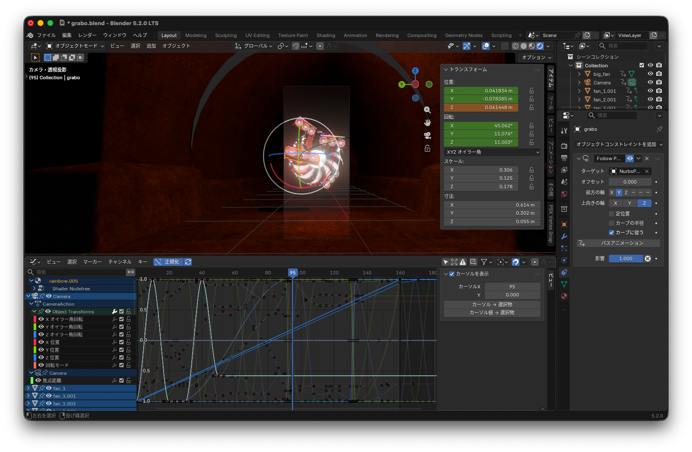

こんにちは。kypです。これは2ヶ月ぶりの開発日記です。

#### ウェブサイトをリニューアルしました

このページを開いた時点で、既にお気づきになった方もいるかとは思うのですが、このページを含む[safehavn.dev](https://safehavn.dev/)の見た目が大きく変わりました。コンテンツや機能面での追加はなく、動的なアニメーションも訪問者数カウンタもSNS共有ボタンすら存在しませんが、サイトのデザインが全面的に刷新されています。デザインは弊チームのmaztaniによるもので、読みやすくミニマルでありながら、どことなくチームの個性やこだわりを感じる仕上がりにできたんじゃないかと思います。以前よりは大人しくなりましたが、変な背景色も相変わらず健在です。

裏側の話をすると、これまでこのサイトではHTMLを直書きしていたのですが、リニューアル後は[Hugo](https://gohugo.io/)で生成できるようになりました。ブログもサクッとMarkdownで書けるようになったしトップページやRSSやOGPの追加作業からも解放されるし、本当に胸が躍ります。これで記事もたくさん書けるようになる......はずです。わかんないけど。あとは長めの文章を書くという、本質的な課題が残されています。

#### 近況とか

SAEKOのSwitch版発売も一段落し、現在は新作にフルスロットルで労力を注いでいます。1日が体感10分くらいで過ぎています。楽しいです。とはいえ、ゲーム開発はやはりスケジュール通りに進まないもので、[7月の記事](https://safehavn.dev/blog/2026-07-07/)で書いていた「10月のゲムダンに出る」という目標は断念することにしました。もし楽しみにしてくれてた人がいたら申し訳ない……！

現在の目標は、2026年中のSteamページ・ティザー公開と、2027年上半期でのイベント出展です。できればBitsummitには参加してみたいし、他にも水面下で準備中のイベントがあったりします。イベントに出るためには、ストアページやPRアセット、それともちろん試遊するためのデモが必要になると思うので、今年の残りを使って準備していきます。

開発の内容について。前回の記事を書いた8月では、まだプロトタイピングの工程から抜け出せていませんでしたが、現在は実際のビルド開発へと進んでいます。アイデアの手応えみたいなのが掴めてきて、よっしゃこれ実際に作っちゃおうぜってなったからです。コード書きまくり。

それとは別に、今作ではなぜか3D動画を作りまくるタスクがあり、kypはこの数週間Blenderに挑戦しています。現時点ではめちゃくちゃ初心者なので、語るのもおこがましいと分かっているのですが、それでも3D作業は楽しくていいですね。DTMとプログラミングを足して2で割らなかったみたいな奥深さがあり、プラスで3D特有の図形的な課題が出てくるので（UV展開とか）、脳のあらゆるニューロンが活性化しています。楽しいです。

作品についても、客観的に面白いかはともかく、少なくともユニークで尖ったものにはなっていると思います。ある意味SAEKO以上に不健康なゲームだし、その日のテンションによってはウゲーってなることも多いのですが、作っていてワクワクすることが多いです。爆弾みたいな、やばいものを作っているというスリルがあります。

初めて作るジャンルだし、ゲームとしてうまく行くかも正直まだ分からないけど、この分からなさが気持ちいいみたいな感じです。ギャンブル大好き。みなさんにもぜひ、このギャンブルの行く末を見届けてもらえると嬉しいです。

おわり！
