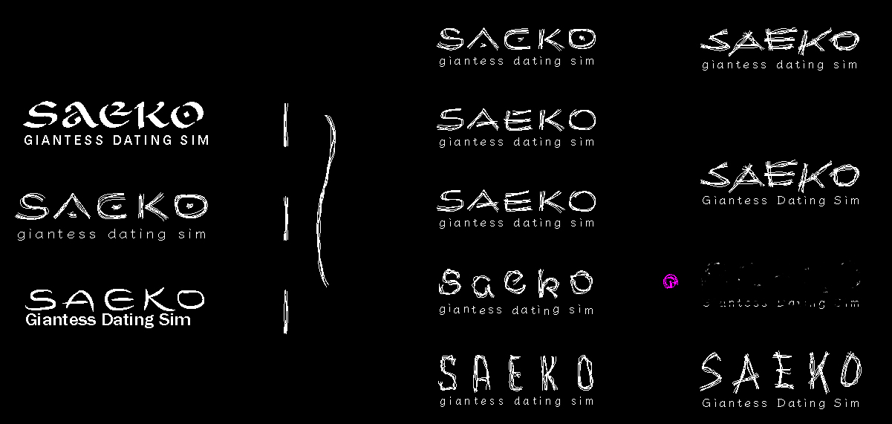

皆様はじめまして。SAFE HAVN STUDIOの[kyp(@_newkyp)](https://twitter.com/_newkyp)です。[SAEKO: Giantess Dating Sim](https://saekogame.com/)というゲームを作っています。

ゲームを発表してからの数ヶ月、作業した日には[Discord](https://discord.gg/3U7H7CjgxP)に進捗を共有するようにしてきました。宣伝のためと、何より自分がサボらないようにするためです。でも、ゲーム制作が進むにつれて、その日の作業内容が全てネタバレ、みたいな感じになってきました。

なので最近、何も具体的に進捗を書けていません。さっき自分でログを読み返したところ、同じような文章が並んでいました。「今日はシナリオを書きました。絵も描きました。おわり」みたいな。

そこで、今週からは毎日更新を諦め、頻度を1週間に1度に落とす代わりに、ブログという場で少し長めの進捗報告ができればと思っています。よろしくお願いします！

  <iframe src="https://store.steampowered.com/widget/2492120/" frameborder="0" width="646" height="190"></iframe>
   
  <small>もし、本当に万が一もしあなたがウィッシュリスト登録をしていない場合、今すぐ登録をしてください。これは最後の警告です</small>

#### シナリオを書きました。絵も描きました

すいません、週次にしてもやっぱりこんな感じです。シナリオと絵を書きました。例によってネタバレに直結する内容のものが多く、内容を見せることは難しそうです。

……代わりに！今週は、今書いているシナリオや絵の立ち位置について説明しようと思います。今作っているのは、私達が「体験版」「デモ」と呼んでいる短いバージョンのゲームです。ボリュームはだいたい1時間程度で、ゲームの発売前に無料で公開しようと考えています。

デモのシナリオは、ゲーム本編とは別のものとして書き上げました。色々悩んでいるところではあるのですが、デモは現時点ではゲーム本編の前日譚として、ストーリーに緩やかなつながりを出したいと思っています。

実は、シナリオ自体は既に一度書きあげているのですが、プログラムの動作確認をするたびに文が目に入ってくるので、細かい表現とかストーリーの流れとかが気になって、気づいたらめちゃくちゃ書き直しています。最終的には、元の文章がほぼ残らなくなるような気もしています。

なので、「デモのシナリオ100%完成した！」となるまでにはまだ少し時間が必要そうです。まあでも、90%くらいのところにはいるはず！たぶん！おそらく！

#### サウンド

今週のメイントピックはサウンドです。先週まで、デモは全くの無音でした（音の鳴らし方すら知りませんでした）。あまりに無音で寂しいので、「脳波　喜ぶ　BGM」とかで検索して出てきたサイケデリックなサムネイルのYouTube動画を流したりしていました。

  <iframe width="560" height="315" src="https://www.youtube.com/embed/a9n_4d64dUw" title="YouTube video player" frameborder="0" allow="accelerometer; autoplay; clipboard-write; encrypted-media; gyroscope; picture-in-picture; web-share" allowfullscreen></iframe>
   
  <small>このBGMまじで昔からある</small>

ですが、今週ついに最初のBGMとSEを作り、ゲーム内に組み込むところまで至りました！音がつくと、なんかゲームって感じがすごくします。ふんわりした表現で申し訳ないです。

BGMの曲調について。元々頭の中では、引き出しの中のシーン（画面が黒いシーン）ではBreakcoreを使いたいと考えていました。SAEKOのビジュアル（特に引き出しの中のシーン）はだいぶBreakcoreの影響を受けてるし、焦燥感とか激しめの表現がSAEKOのテーマに合っていると思ったからです。

でも、なんとなく想像はできていたのですが...BreakcoreはノベルゲームのBGMとして、激しすぎました！キャラクターが大笑いしたり真剣に悩んだりしている裏で、倍速で切り刻まれたアーメンブレイクが鳴り続けています。正直、文字とか読んでる場合じゃないです。今すぐ踊り出すべき。

悩みながら、[HOPE LEFT ME](https://store.steampowered.com/app/2268470/HOPE_LEFT_ME/)というゲームもプレイしました。Breakcore系のアーティストであるAstrophysicsさんが作ったノベルで、自身の作曲された同名のアルバムをBGMとして使用しています。なんと「VNカット（ゲーム用アレンジ版）」「LPカット（アルバム版。原曲）」の2種類からBGMを選ぶことができるのですが、VNカットを選ぶと、原曲ほどの激しいドラムパートはあまり出てこなくなります。色々と苦労があったのかもしれない、と思わされました。

  <iframe src="https://store.steampowered.com/widget/2268470/" frameborder="0" width="646" height="190"></iframe>
   
  <small>Это хорошая игра</small>

自分も悩んでいたのですが、結局曲調を少し変えてみることにしました。いま一番しっくり来ているのは、Chill BreakcoreとDeep Dubstepを融合させたような曲調です（説明が難しい……）。しっくり来るし、個人的にも好みで作るのが楽しいし、この曲調で何個かパターンを作りたいです。

まあでも、冴子との会話シーンや、ここでは明かせない秘密のシーンのためにも、別の曲調にもチャレンジする必要がありますね。やることたくさん……

#### ロゴ制作

それから、最後に輝かしい進捗がもう1つ！先月からメンバーの[@maztani](https://twitter.com/k_maztani)に全面協力していただき、ゲームの正式なロゴを作り始めました。方向性にケチをつけたりして（「良いんだけど、別のパターンも見てみたいですね」）、結果的に十数個もパターンを作ってもらいました。いいものがたくさんあったのですが、最終的に採用できるものは1つだけなので、恐る恐る何個か切り捨てました。申し訳ないです。自分が同じことされたら泣くと思います。

  <small>作ってもらったロゴ案の数々。きちんと供養しなければ、化けて出てくるかもしれない</small>

実際に採用されたロゴはここでは公開せず、今後新しいバナーだったりカバーだったりが揃った段階でまとめてお見せしたいと思っています。SAEKOのスピリットを伝える、ユニークでクールなロゴが仕上がったと思います。ゆるりとご期待いただけると嬉しいです。

#### 最後に

というわけで、今週の進捗はこんな感じでした。毎日書こうとすると、「1日あったのにこれしか出来なかったのか……」みたいなに思ってけっこう苦しいのですが、1週間単位で書き出すとわりとたくさん書けますね。ポジティブな気持ちになれていいので、今後もこのスタイルで書いていきたいです。

関係のない日記：先週から、[ダンガンロンパV3](https://store.steampowered.com/app/567640/V3/?l=japanese)をプレイしています。16人の生徒同士で殺し合いをします。過去作をプレイして分かっていたことなのですが、好きなキャラクターがどんどん死んでいきます。

苦しいです。ここを出たら、一緒にデートをしようって約束したのに……

……

でも、夜中の冷蔵室に忍び込んで、好きだった女の子の冷たい手を握ったりしたいですよね。顔を覆っていた暗い毛布を外すと、青い顔には生気がなくて、ああ、君は本当に死んでしまったんだ、あの瞳の輝きは僕の記憶の中にしかない、なのになんで、僕はまだ君を忘れられずにいるんだろう、記憶の中だけに生きている君より、他に優先すべきことがたくさんあるのに、どうして、どうして……

*どうしたの？*

耳の奥から声が聞こえた。そんなはずはない。その透明で美しい声色は、記憶の中で何度も反芻した、誰よりも大好きだったあの子の――

*変なの。そんな、幽霊を見たみたいな顔しちゃってさ。*

……そうだね。でもね、君はほんとに幽霊なんだよ。残酷なコロシアイに巻き込まれて、それで――

*本来の原稿にはこの短編小説の続きが書かれていたのですが、微妙だし途中で投げ出していたのでこの辺で切り上げます。今週の開発ログはここまでです。また来週お会いしましょう！*
